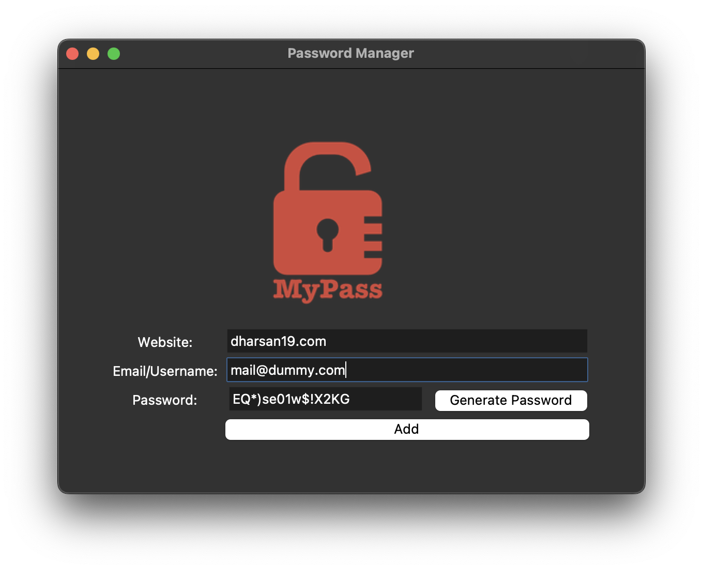
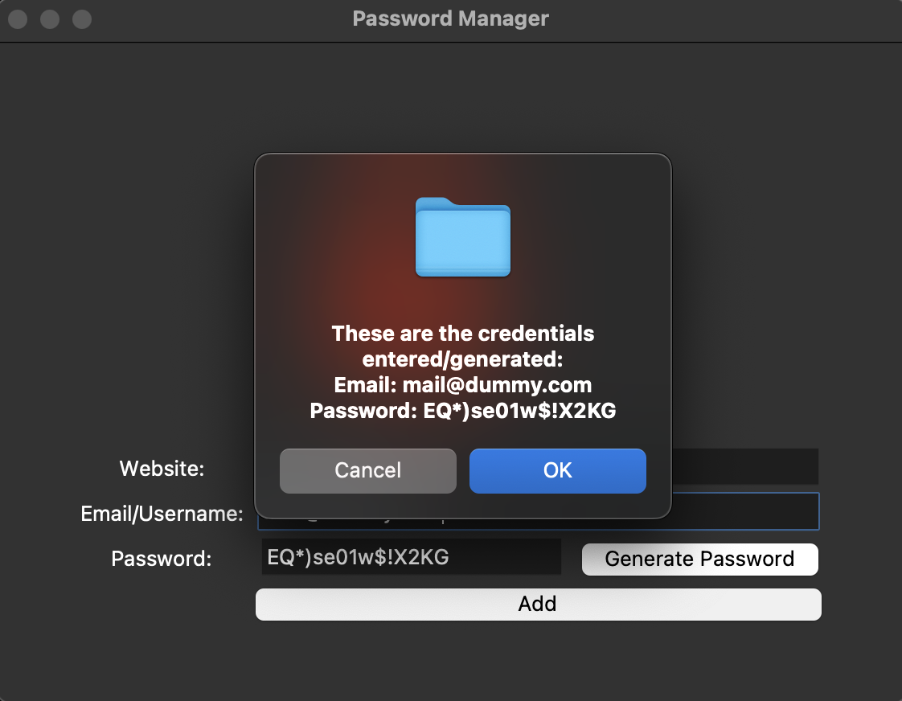

# 🔐 Password Manager

A simple and secure **Password Manager GUI application** built using **Python and Tkinter**.  
This tool helps you **generate strong passwords**, **copy them automatically**, and **save credentials locally** for future reference.

---

## 🚀 Features

- ✨ **Random Password Generator** — Generates strong, unique passwords with letters, numbers, and symbols.  
- 📋 **Auto-Copy to Clipboard** — Instantly copies the generated password using `pyperclip`.  
- 💾 **Save Credentials** — Stores your website, email/username, and password in a local file (`data.txt`).  
- ⚠️ **Field Validation** — Prompts you if any field is left empty before saving.  
- 🧭 **Simple GUI** — Built with Tkinter for easy use and clean layout.

---

## 🧩 Tech Stack

- **Language:** Python 3  
- **Libraries:**  
  - `tkinter` – for GUI  
  - `pyperclip` – for clipboard functionality  
  - `random` – for password generation

---

## 📦 Installation & Setup

1. **Clone the Repository**
   ```bash
   git clone https://github.com/yourusername/password-manager.git
   cd password-manager
   ```
2.	**Install Dependencies**
    ```bash
    pip install -r requirements.txt
    ```
3. **Run the Application**
    ```bash
    python main.py
    ```
---
## ⚙️ How It Works
	1.	Enter the website name and email/username.
	2.	Click Generate Password to create a strong random password.
	3.	The password is copied automatically to your clipboard.
	4.	Click Add to save the credentials in data.txt.

---

## 🧠 Future Enhancements
	•	🔒 Encrypt stored passwords
	•	🗃️ Add search functionality
	•	☁️ Store credentials securely in a cloud database

---

## 📸 Screenshots

### 🖥️ Main Screen


### ✅ Confirmation Popup


---